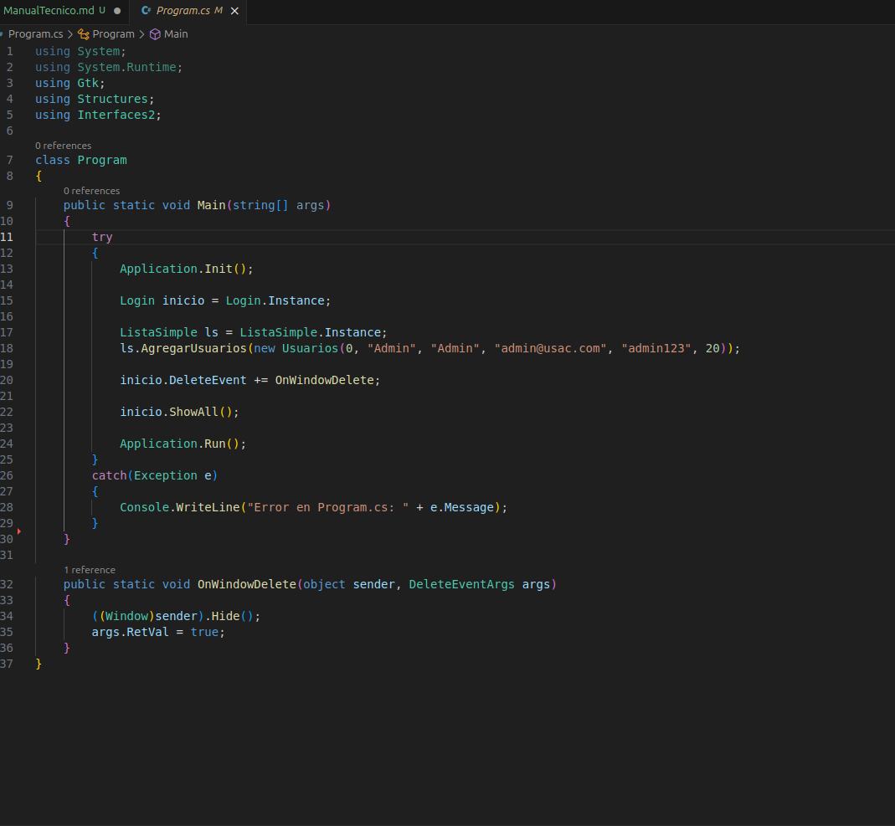
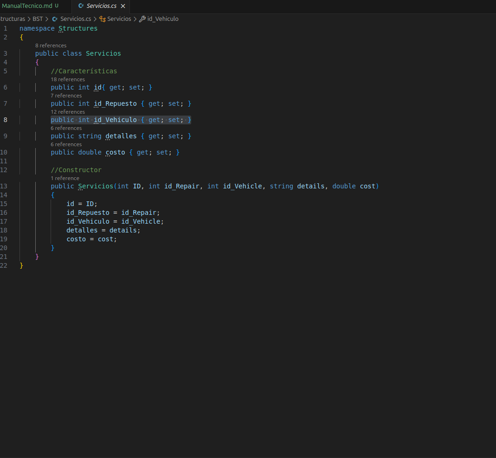
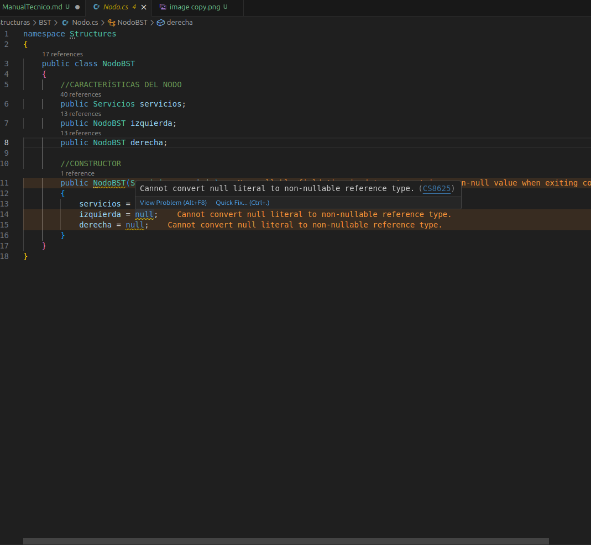
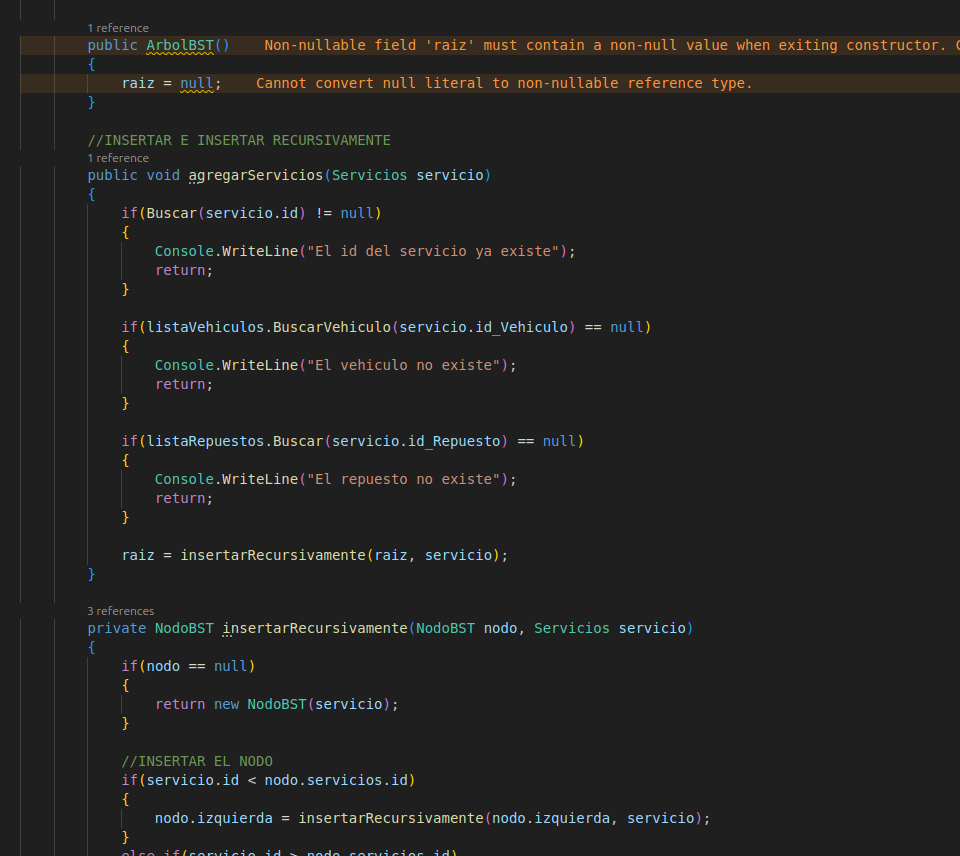
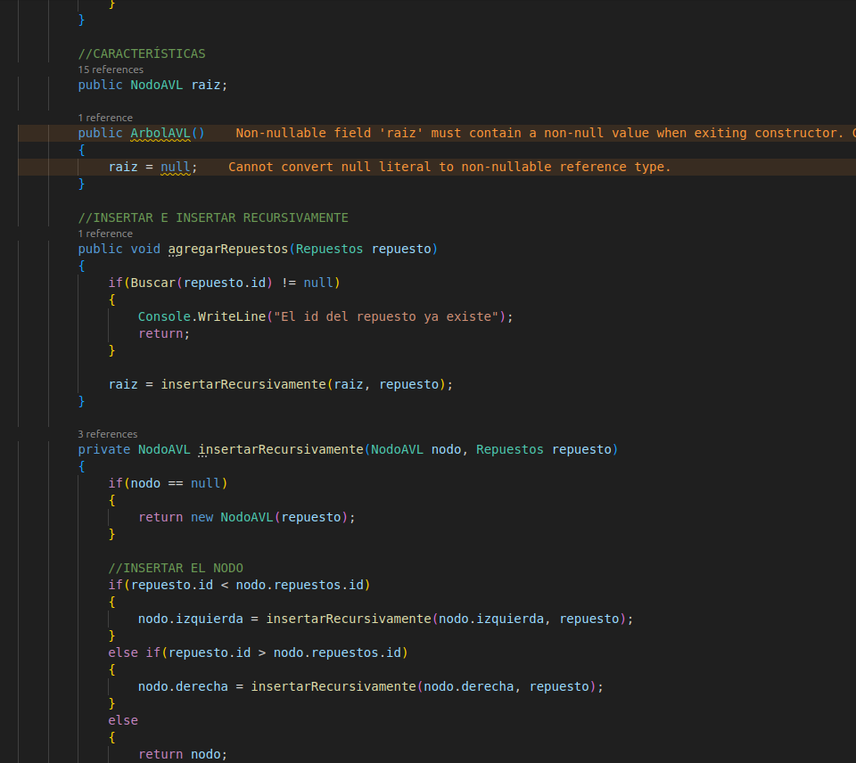
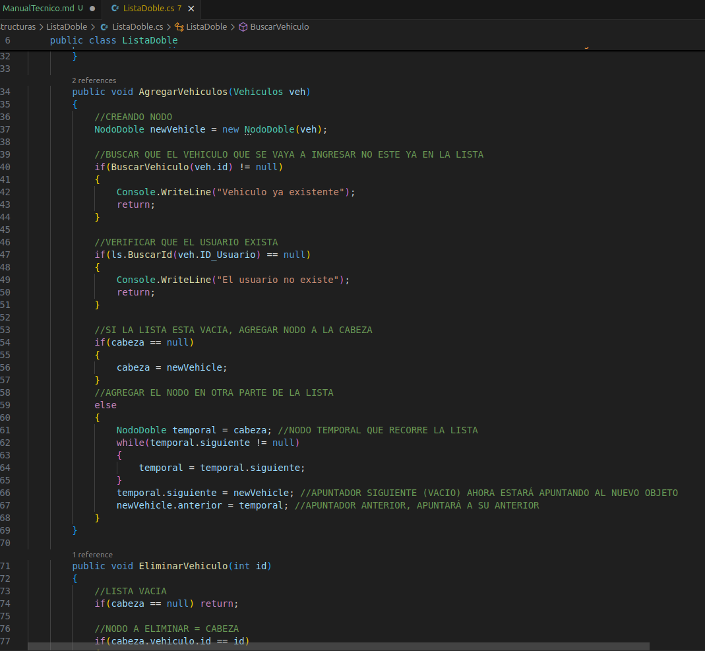
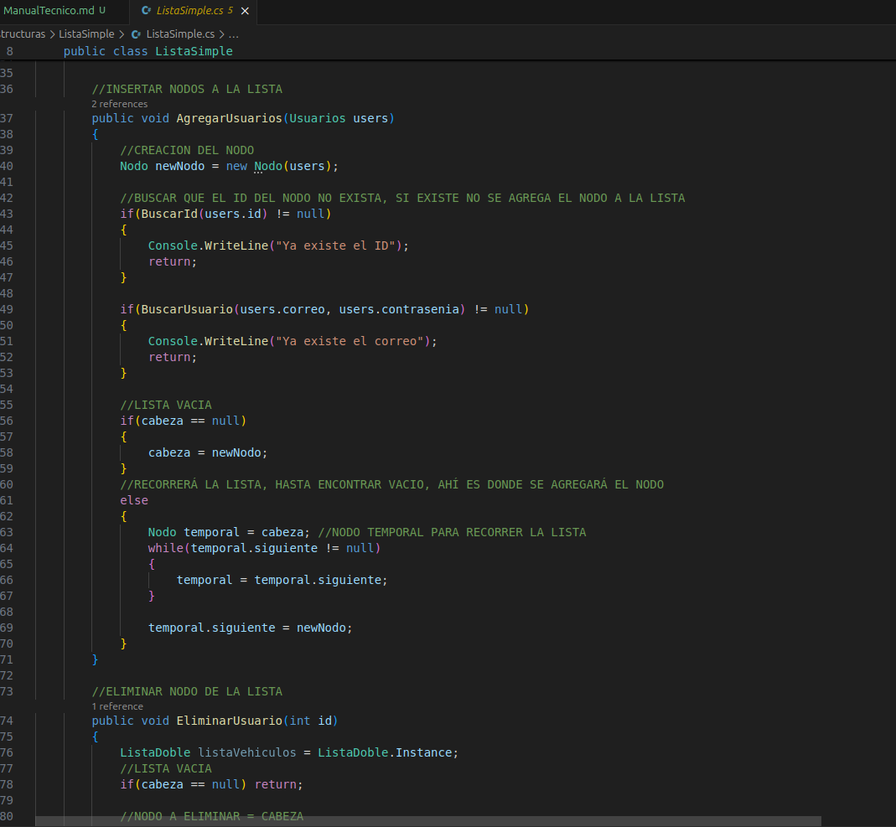
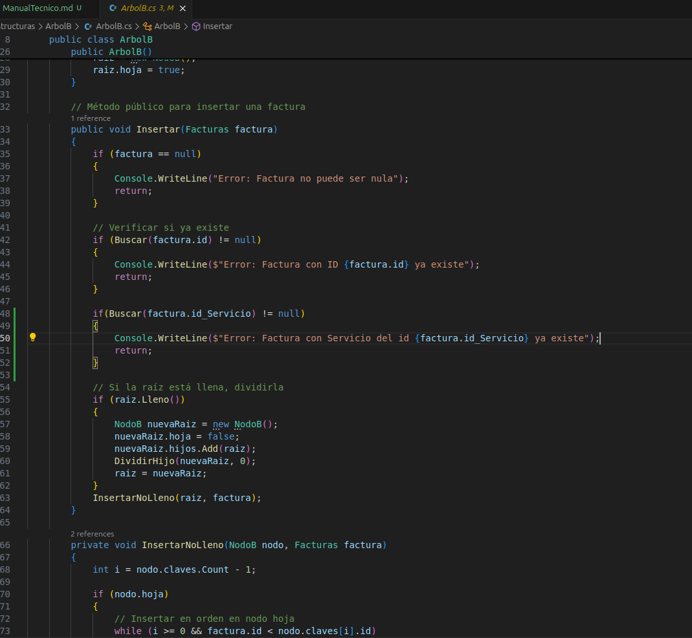

# Manual Técnico

## Introducción
Este manual técnico tiene como finalidad explicar el código desarrollado para un proyecto en Linux, utilizando **C#**, **.NET** y **Visual Studio Code (VSC)**. Está dirigido a desarrolladores y técnicos que deseen entender, instalar y ejecutar el proyecto.

---

## Especificaciones

### Requisitos del sistema
- **Sistema operativo**: Ubuntu 24.04 (o superior).
- **.NET SDK**: Versión 8.0 o superior.
- **Visual Studio Code**: Última versión estable.
- **Memoria RAM**: Mínimo 2 GB (recomendado 4 GB).
- **Espacio en disco**: Mínimo 500 MB.

---

### INSTALACION DE C# Y DE .NET Y VSC
Para la instalación de .NET (que contiene C#) en Ubuntu, hay que abrir la terminal y escribir los siguiente comandos: 

INSTALAR C#
~~~
sudo apt update && sudo apt upgrade -y
sudo apt install -y wget apt-transport-https software-properties-common
~~~

AGREGAR REPOSITORIO DE MICROSOFT
~~~
wget https://packages.microsoft.com/config/ubuntu/24.04/packages-microsoft-prod.deb
sudo dpkg -i packages-microsoft-prod.deb
~~~

DEPENDENCIAS
~~~
sudo apt install -y dotnet-sdk-8.0
~~~

VERIFICAR INSTALACIÓN
~~~
dotnet --version
~~~

INSTALAR VISUAL STUDIO CODE
~~~
sudo apt update
sudo apt install wget gpg
wget -qO- https://packages.microsoft.com/keys/microsoft.asc | gpg --dearmor | sudo tee /usr/share/keyrings/packages.microsoft.gpg > /dev/null
echo "deb [arch=amd64 signed-by=/usr/share/keyrings/packages.microsoft.gpg] https://packages.microsoft.com/repos/code stable main" | sudo tee /etc/apt/sources.list.d/vscode.list
sudo apt update
sudo apt install code
~~~

Con esto ya tendriamos la instalación tanto de C#, .NET y de Visual Studio Code.

Ahora proseguiremos a explicar el código, primero para crear un proyecto en C#, debemos escribir en la terminal lo siguiente: 
~~~
dotnet new console -n name
~~~
Y con eso crearemos el proyecto de C#

***
Entonces proseguiremos a explicar el código del Program.cs, que es donde se ejecuta el proyecto (el Program.cs es el equivalente a decir que es el main, entonces es ahí donde se ejecutará el programa)

Program.cs:

Métodos:
+ Main(): Es el método que se ejecuta, en este método estamos instanciando la ventana principal y la lista simple enlazada, para guardar al administrador.
+ OnWindowDelte(): Es el método que hace que cuando se cierre la ventana termine o esconda el programa.
***

Luego de eso tenemos 4 carpetas: 
- Estructuras
- generarDot_Png
- Intefaces
- Reportes

A continuación estaremos hablando de los archivos que están en Estructuras. Cabe destacar que cada estructura la dividimos en 3:
- Información dentro del Nodo
- Nodo
- Estructura

Por lo que únicamente se explicará una vez la parte de la Información dentro del Nodo y el Nodo para que no sea redundante el Manual

***
Dentro de la carpeta Estructuras tenemos: 
La carpeta BST que contiene: 
- Servicios.cs
- Nodo.cs
- ArbolBST.cs

Servicios.cs (Información dentro del nodo):

La clase Servicios nos va a servir o su uso es para la información que contendrá el nodo del arbol BST. Cada que vez que llamemos a la clase Servicios, tendrá que tener todas los parametros que se le puso en el constructor.

Nodo.cs (Nodo):

La clase Nodo simulará el comportamiento de un Nodo BST, que debe contener la información y el apuntador a izquierda y derecha.

ArbolBST.cs:

Los métodos importantes del  son:
- agregarServicio(): este método nos permitirá ingresar los nodos al arbol BST, de tal manera que los nodos siempre se ingresan a la izquierda o derecha, dependiendo si es mayor o menor a la raiz, que además va complementando con un metodo que inserta recursivamente a la izquierda o derecha.
- Buscar(): buscará el nodo con el id que ingresamos, que va complementada a un metodo de busqueda recursiva.
- graphvizBST(): es el método que retornará un string en formato de .dot de los nodos de nuestra del arbol BST

***
Arbol AVL:
- Repuestos.cs
- Nodo.cs
- ArbolAVL.cs

ArbolAVL.cs:

Métodos:
+ agregarRepuesto(): primero crea el nodo, verifica a donde debe ir (izquierda o derecha) luego actualiza la altura, obtenemos el factor de balance, si el factor de balance es diferente a: -1, 0, 1; entonces hacemos una rotacion.
+ Buscar(): recorre el arbol, va revisando la raiz, si el valor es menor, va hacia el subarbol izquierdo, y en caso contraria va al lado derecho, y así hasta encontrar el nodo buscado
+ graphvizCircular(): nos retorna un string en formato de dot

***
Lista Doble:
- Vehiculos.cs
- Nodo.cs
- ListaDoble.cs

ListaDoble.cs:

Métodos:
- agregarVehiculos(): crea el nodo, revisa si la cabeza esta vacía, si lo esta, el nodo nuevo es la cabeza de la lista, sí no lo esta, buscará un nodo que su apuntador siguiente sea nulo y que ese apuntador siguiente ya no apuntará a nulo, sino que apuntará al nuevo nodo
- eliminarVehiculo(): si el nodo a eliminar es la cabeza, reposicionamos los nodos, el segundo será la cabeza, para que así el primer nodo se elimine; en cambio si el nodo a eliminar no es la cabeza, hay que redirigir los apuntadores, el nodo anterior apuntará al nodo siguiente, y el nodo siguiente apuntará al nodo anterior; y luego de eso liberamos la memoria.
- buscarVehiculo(): buscará por la lista el nodo que contenga el id buscado
- graphvizDoble(): retornará un string en formato dot

***
Lista Simple:
- Usuarios.cs
- Nodo.cs
- ListaSimple.cs

ListaSimple.cs:

Métodos:
- AgregarUsuarios(): se crea el nodo, si la cabeza esta vacía, entonces el nodo nuevo pasará a ser la cabeza de la lista; de lo contrario recorrerá la lista hasta encontrar un nodo en donde su apuntador sea nulo, entonces ese apuntador se rediccionará al nuevo nodo
- EliminarUsuario(): si el nodo a eliminar es la cabeza, el segundo nodo pasará a ser la cabeza; de lo contrario redireccionaremos el apuntador del nodo anterior al nodo siguiente; y luego de eso liberamos la memoria
- BuscarUsuario(): recorrerá la lista hasta encontrar el nodo que contenga el id qu buscamos
- graphvizLista(): retornará un string en formato de dot de la lista

***
ArbolB
- Nodo.cs
- Facturas.cs
- ArbolB.cs

ArbolB.cs:

Métodos:
- Insertar(): si la raiz esta llena, crea una nueva raiz, luego divide la raiz y actualiza la raiz del arbol.
- InsertarNoLleno(): si es una hoja, busca una posicion ordenada e inserta, si no es hoja, encuentra el hijo adecuado, si el hijo esta lleno lo divide, ajusta el indice si es necesario, y llama recursivamente al método con el hijo correcto
- DividirHijo(): Toma el hijo lleno y crea un nodo hermano, promueve la clave media del padre, distriibuye las claves mayores al nuevo nodo o distribuye los hijos al nuevo nodo, y de ultimo actualiza referencias en el padre

***
Ahora que terminamos con la carpeta Estructuras, seguiremos con la carpeta 'generarDot_Png'

Dentro de esta carpeta solo tenemos el archivo:  
Convertidor.cs

Dentro de este archivo tenemos los siguientes métodos: 
- generarArchivoDot(string nombre, string contenido): primero crea una carpeta de reportes si es que no existiese, luego pasa el nombre con el que se guardara el archivo dot, en caso de el nombre del archivo no se guarde con la extensión dot, se le agreará el .dot al final del nombre. Luego por ultimo agregar todo el contenido que le pasamos al archivo dot
- ConvertidorDot_a_Png(string nombre): crear la carpeta Reportes en el caso de que no existiese, luego crear un archivo donde cambia el nombre del archivo dot, y lo cambia a .png; luego ejecuta el comando .dot que lo convierte en imagen.

***
Ahora veremos que es lo que contiene la carpeta Interfaces, en este no se detallará todos los métodos, y se hará un resumen de cada interfaz.

Tengo 2 carpetas, una para el admin y otra para el usuario, además de 2 archivos: 

- Login.cs: será la interfaz donde nos logueemos, ya sea como administrador o como usuario
- manejoSesion.cs: cuando se ingresa como usuario, este archivo nos servirá para guardar sus datos mientres este en la interfaz de usuario

En la carpeta de Admin tenemos: 
- Opciones.cs: cuando nos logueemos como admin, nos mostrará las opciones que tendrá el administrador, además el boton de Reportes, generá los reportes de las estructuras
- CargaMasiva.cs: interfaz para realizar las cargas masivas de Usuarios, Vehiculos y Repuestos
- Gestion.cs: interfaz para buscar y/o eliminar Usuarios y/o vehiculos
- ActualizacionRepuesto.cs: interfaz donde busca un repuesto y se puede modificar/actualizar
- VisualizarRepuestos.cs: podremos ver en una tabla, los repuestos existentes, en Pre/En/Post Orden
- GenerarServicios.cs: aquí es donde se crean los servicios y facturas, siempre se verifica que los vehiculos y/o repuestos existan para ingresar los servicios y facturas

En la carpeta de Usuario tenemos: 
- insertarVehiculo.cs: interfaz para que el usuario pueda ingresar un vehiculo de él.
- verServicios.cs: aquí se puede ver en una tabla los servicios que tienen sus carros, y se pueden ver en Pre/En/Post orden
- verFacturas.cs: aquí se puede ver en una tabla las facturas pendientes de pago que tiene el usuario.
- cancelarFactura.cs: busca una factura del usuario y se puede pagar la factura, y desaparecería la factura y el servicio.

***
Y por último está la carpeta Reportes, que contiene todos los archivos dot y png que nos generá el programa.

