# Manual de Usuario

## Introducción
Este manual está diseñado para guiar a los usuarios en el uso de la **primera fase del proyecto de Estructura de Datos del año 2025**. Aquí encontrarás instrucciones detalladas para instalar, configurar y utilizar el programa.

---

## Requisitos del sistema
- **Sistema operativo**: Windows 10, macOS 10.15 o superior, Ubuntu 20.04.
- **Memoria RAM**: Mínimo 4 GB.

---

## Instrucciones paso a paso

### 1. Compilar y ejecutar el programa
1. Abre una terminal en la carpeta del proyecto.
2. Ejecuta el siguiente comando para compilar el programa:
~~~
dotnet build
~~~
3. Luego escribir en la consola:
~~~ 
dotnet run 
~~~

### 2. Inicio Sesioón

Le aparecerá la siguiente ventana:
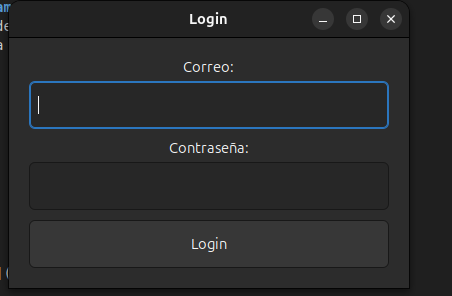

1. En la entrada de texto debajo de correo ingresamos: *admin@usac.com* , y en la entrada de texto debajo de contraseña ingresamos: *admin123* y luego clic a Login para ingresar como Admin

### 3. Opciones del Admin
Nos aparecerá esta ventana: 
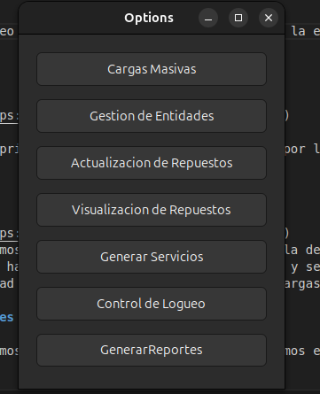

La recomendación para el usuario es que primero ingresé a las Cargas Masivas, por lo cual ingresaremos a esa ventana.

### 4. Cargas Masivas

1. Nos aparecerá una ventana así: 
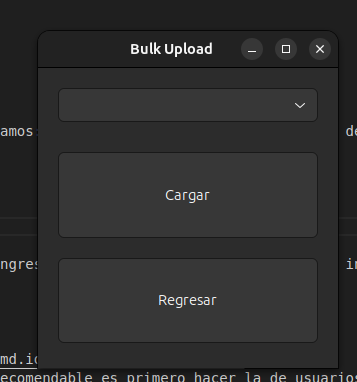
Elegiremos que tipo de carga Masiva haremos, lo recomendable es primero hacer la de usuarios y luego la de vehículos y luego la de repuesto. Luego de elegir que tipo de carga Masiva deseamos hacer le damos clic al botón *Cargar* y se nos abrirá el explorador de Archivos, seleccionamos el archivo Json que contiene los datos del tipo de entidad que elegimos. Luego  de hacer las cargas masivas de todo, podemos regresar a la ventana anterior.

### 5. Gestion de Entidades

1. Luego de regresar a la ventana, le damos clic a 'Gestion de Entidades' y podemos elegir que entidad deseamos aeliminar de su respectiva lista.
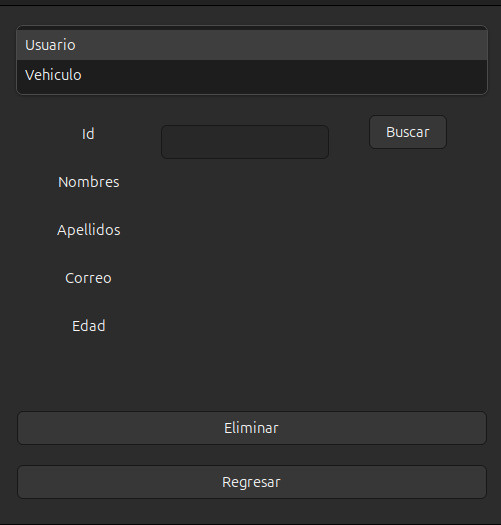

### 6. Actualizacion de Repuestos

1. Luego de regresar a la ventana, le damos clic a 'Actualizacion de Repuestos' y podemos buscar a un repuesto dentro de la lista, y lo podemos actualizar.
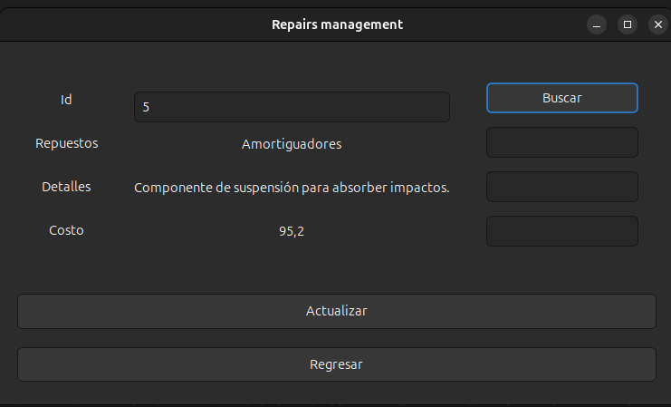

### 7. Visualizacion de Repuestos

1. Luego de regresar a la ventana anterior, le damos clic al botón de *Visualizacion de Repuestos* y aquí podremos ver una tabla con los repuestos, elegimos una opcion del combo box, para ver en que orden deseariamos verlos.
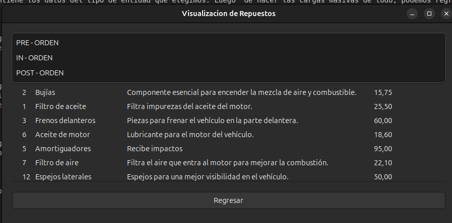

Y luego podemos regresar a la ventana anterior

### 8. Generar Servicios

1. Luego de regresar a la ventana anterior, le damos clic al botón *Generar Servicios* y aquí llenaremos todos los campos para poder agregar un servicio y factura.

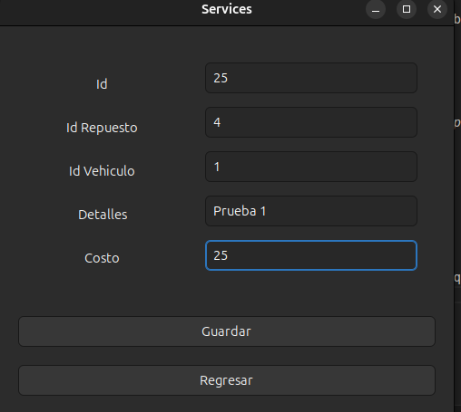

Luego de crear los servicios y facturas ya podemos regresar a la ventana anterior

### 9. Reportes

1. Luego de regresar a la ventana anterior, le damos clic al botón de *Reportes* que nos generará los Reportes de todas las estructuras

### 10. Opciones Usuario

1. Luego de generar los reportes podemos ingresar como usuario y nos saldrá esta interfaz de opciones:
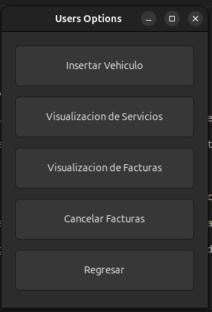

### 11. Insertar Vehiculo

1. Se llenaran los campos necesarios para ingresar un nuevo vehiculo del usuario y luego se ingresará a la lista
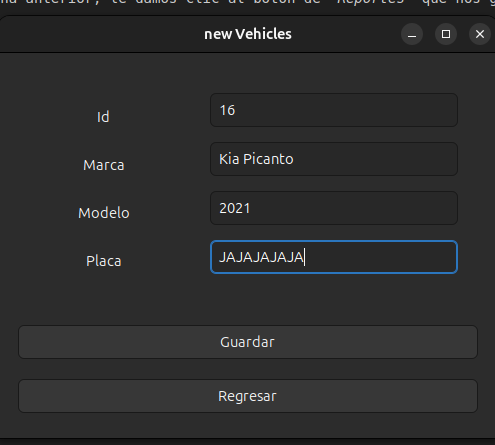

### 12. Visualizacion de Servicios

1. Luego de regresar a la ventana anterior, le damos clic al botón de *Visualizacion de Servicios* que nos permitirá ver los servicios que tenemos pendientes de pago, además de que se puede escoger una opción en el combo Box, para ver en que orden deseamos verlo
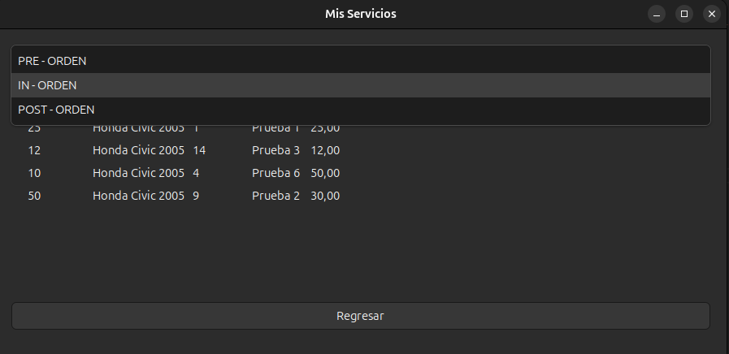

### 13. Visualizacion de Facturas

1. Luego de regresar a la ventana anterior, le damos clic al botón de *Visualizacion de Facturas* que nos permitirá ver las facturas que tenemos pendientes de pago.
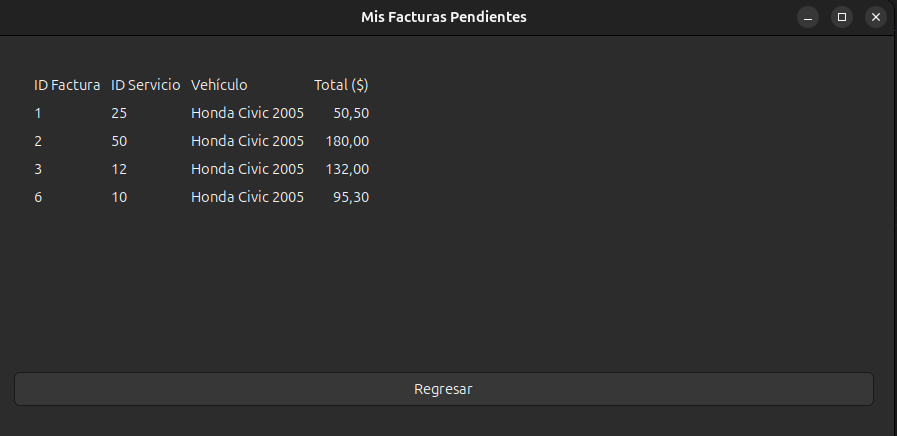

### 14. Cancelar Facturas

1. Luego de regresar a la ventana anterior, le damos clic al botón de *Cancelar FActuras* que nos permitirá buscar una factura del usuario y poder pagarla.
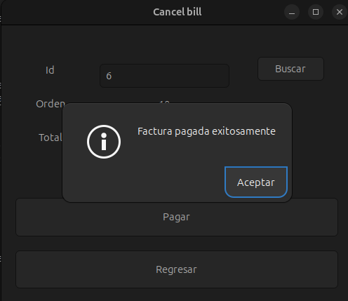

Y podemos cerrar la ventana luego de salir. Y para terminar el programa, nos vamos a la terminal y usamos la combinación de letras *Ctrl + C*

---

## Consejos y recomendaciones

- Orden de cargas: Realiza las cargas masivas en el siguiente orden: usuarios, vehículos, repuestos.

- Formato de archivos JSON: Asegúrate de que los archivos JSON estén correctamente formateados antes de cargarlos.

- Copias de seguridad: Realiza copias de seguridad de los datos importantes antes de realizar cambios masivos.

## Solución de Problemas
- El programa no inicia: Verifica que .NET esté correctamente instalado y que cumpla con los requisitos del sistema.

- Archivo JSON no se carga: Revisa que el archivo JSON esté correctamente formateado y que no contenga errores.

- Error al iniciar sesión: Asegúrate de ingresar las credenciales correctas (admin@usac.com y admin123).